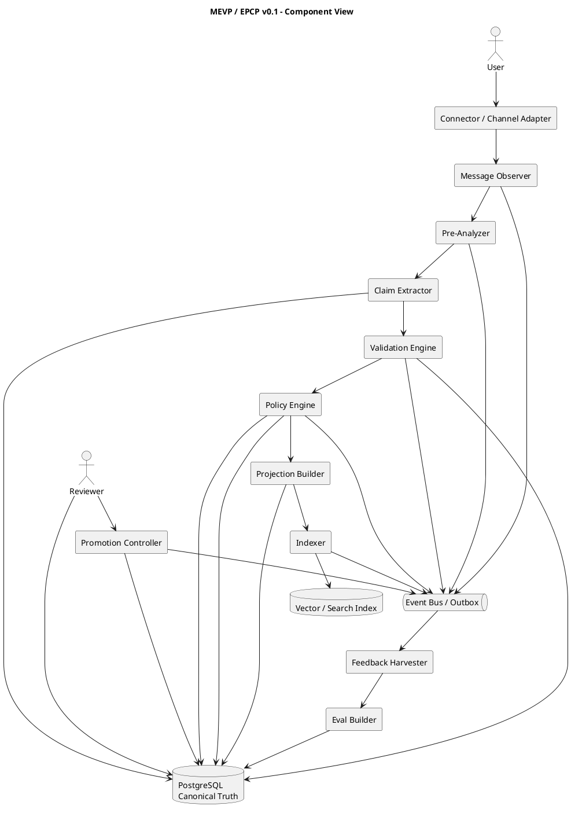
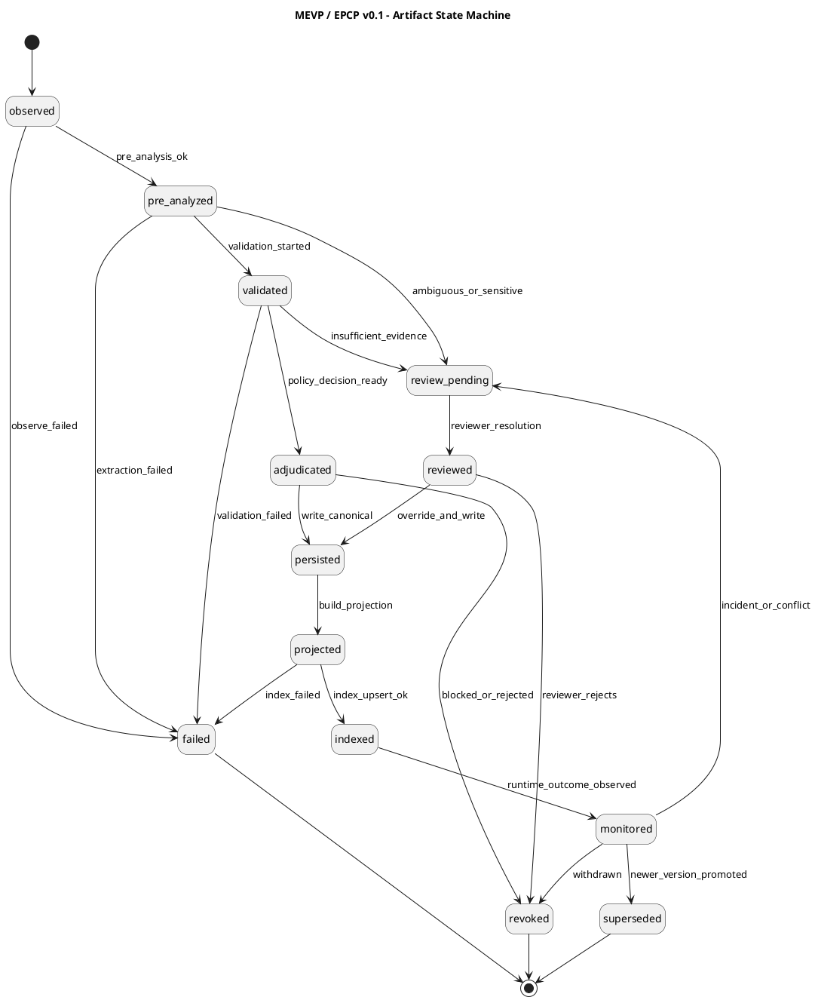

# MEVP / EPCP v0.1 — Protocol Spec

- **Title:** **MEVP / EPCP v0.1**
- **Expansion:** **Message Evidence Validation Protocol / Evidence & Policy Control Plane**
- **Status:** Draft for architecture review
- **Date:** 2026-03-25
- **Context:** CollabSphere / enterprise knowledge, agent, messaging and RAG workflows
- **Document type:** protocol spec / engineering draft
- **Modal language:** **MUST / SHOULD / MAY** are used in the normative sense

---

## 1. Executive decision

This document defines the target form of the protocol for **real-time validation of incoming and outgoing messages**, **provenance construction**, **policy-aware adjudication**, **controlled reindexing**, and a **controlled improvement loop**.

Key decision:

1. **Do not** build a “self-learning system on its own answers.”
2. Build an **evidence control plane**, where:
   - every message becomes a **knowledge event**;
   - every message produces a **provenance record**, **assessment record**, **policy decision**, and **index projection**;
   - the **real-time adjudication loop** is separated from the **controlled improvement loop**;
   - **PostgreSQL** remains the **canonical source of truth**;
   - the **vector/search layer** receives only the **retrieval projection**, not the full governance state;
   - promotion of new scorers / rules / policies goes through **evals + review + rollout**, not direct “self-correction” on production answers.

---

## 2. Problem statement

A conventional RAG pipeline solves only part of the problem:

- finds similar fragments;
- produces an answer;
- sometimes returns citations.

This is insufficient for enterprise scenarios that require:

- provenance and explainability;
- trust segmentation between organizations and contexts;
- real-time validation of incoming and outgoing messages;
- controlled reindex and supersession;
- distinction among **factual-safe**, **supporting-only**, **disputed**, **needs-review**, and **blocked**;
- a safe feedback loop;
- separation of **retrieval**, **governance**, **policy**, **monitoring**, and **improvement**.

MEVP / EPCP introduces a unified protocol that closes this gap.

---

## 3. Design basis and external alignment

The protocol builds on existing standards and practices, but **does not copy any of them wholesale**.

### 3.1. Provenance foundation

The protocol uses a model in the spirit of **W3C PROV**:

- **Entity** — message, document, version, fragment, evidence bundle;
- **Activity** — ingestion, extraction, validation, adjudication, indexing, review, promotion;
- **Agent** — user, model, parser, scorer, policy engine, reviewer, connector.

This model is needed so that provenance is not a set of arbitrary JSON fields, but a formalized and portable data-origin system.

### 3.2. Event and lineage foundation

For the event model, the protocol uses logic similar to **OpenLineage**:

- **job**
- **run**
- **dataset**
- **facets**

This provides a sound semantics for recording **which job**, **in which run**, **which input**, **which output**, and **with which additional attributes** performed a transformation over knowledge artifacts.

### 3.3. Telemetry foundation

For runtime tracing, the protocol is compatible with the logic of **OpenTelemetry GenAI semantic conventions**:

- spans and events for model calls;
- messages, prompts, tool calls;
- agent/framework spans;
- telemetry for inference and orchestration.

This matters because MEVP / EPCP must operate not as a “separate knowledge base,” but as an **observable control plane** over the runtime.

### 3.4. Tooling and external protocol surface

For the external tool/runtime surface, the protocol must be compatible with the **MCP** approach:

- search / inspect / explain / submit review;
- portability between clients and agent environments;
- the possibility of moving some capabilities later-stage into an external protocol/API surface.

### 3.5. Monitoring and controlled improvement

The monitoring and feedback approach should align with the logic of **NIST AI RMF** and the challenges of **post-deployment monitoring**, and the improvement loop should be closer to **structured evals** than to uncontrolled online self-learning.

---

## 4. Core protocol principles

### 4.1. Canonical truth vs retrieval projection

1. **PostgreSQL MUST** be the canonical source of state.
2. **Vector/search storage MUST NOT** be the system of truth.
3. All governance decisions, versions, reviews, contradictions, promotion events, and policy decisions **MUST** be recorded in the canonical store.

### 4.2. No self-confirming loop

1. A model’s production answer **MUST NOT** automatically become trusted knowledge.
2. The system’s own answers **MAY** be used only as:
   - candidate feedback artifact;
   - incident signal;
   - eval case seed;
   - reviewer queue item.
3. Production outputs **MUST NOT** directly change scorer weights, policy classes, or authority tiers.

### 4.3. Split loops

The protocol **MUST** separate two loops:

- **Real-time adjudication loop**
- **Controlled improvement loop**

They **MUST NOT** be merged into a single continuous self-editing pipeline.

### 4.4. Policy-first messaging

Each message must undergo not only retrieval, but also **policy-aware adjudication**.
The system must evaluate not only “is this relevant,” but also:

- is it admissible;
- is there enough evidence;
- is there a conflict;
- is the answer factual-safe;
- is human review needed;
- is supersession / reindex required.

### 4.5. Explainability by construction

Any significant system decision **MUST** be explainable through:

- evidence refs;
- score breakdown;
- gates / penalties;
- provenance chain;
- rule / scorer / policy version.

---

## 5. Scope

The protocol covers:

- incoming messages;
- outgoing messages;
- claims, references, evidence;
- retrieval and validation decisions;
- index projection updates;
- reindex / supersession;
- contradiction / corroboration handling;
- reviewer workflow;
- promotion loop;
- external inspect/explain interfaces.

The protocol does **not** describe:

- model fine-tuning;
- foundation-model training;
- the business logic of a specific vertical use case;
- transport-level details of a specific queue or HTTP API;
- the final UX.

---

## 6. High-level architecture

```text
Incoming/Outgoing Message
  -> Observe
  -> Pre-analyze
  -> Validate
  -> Adjudicate
  -> Persist canonical truth
  -> Project retrieval metadata
  -> Update vector/search indexes
  -> Monitor outcomes
  -> Harvest errors
  -> Build eval cases
  -> Promote new scorer/policy versions by controlled rollout
```

---

## 7. Normative requirements

### 7.1. Message handling

1. Every incoming and outgoing message **MUST** receive a stable `message_id`.
2. Every message **MUST** have a `direction`:
   - `incoming`
   - `outgoing`
   - `internal`
3. Every message **MUST** be linked at minimum to:
   - `tenant_id`
   - `conversation_id`
   - `created_at`
   - `producer_agent_id`
   - `raw_content_hash`

### 7.2. Provenance

1. Every derived artifact **MUST** reference a source artifact.
2. Every activity **MUST** have:
   - `activity_type`
   - `started_at`
   - `finished_at`
   - `agent_id`
   - `run_id`
3. Every policy decision **MUST** indicate:
   - `policy_version`
   - `decision_class`
   - `decision_reason`
   - `evidence_refs`

### 7.3. Index projection

1. Only retrieval-critical projection **MUST** go into the index.
2. Full governance state **MUST NOT** go into the vector store as a source of truth.
3. Superseded / revoked / blocked artifacts **MUST** either be removed or hard-marked in the projection.

### 7.4. Improvement loop

1. Promotion of new rules / scorers / policy versions **MUST** proceed through versioned artifacts.
2. Promotion **SHOULD** support canary / staged rollout.
3. Reviewer-approved correction **MAY** change the canonical state.
4. Unreviewed production output **MUST NOT** directly change the canonical trust class.

---

## 8. Core concepts

### 8.1. Message

The primary textual artifact of communication.

### 8.2. Claim

A normalized claim extracted from a message or document.

### 8.3. Evidence

A fragment, document, table, link, or bundle that supports or refutes a claim.

### 8.4. Assessment

A versioned result of assessing an artifact or claim.

### 8.5. Adjudication

The result of a policy-aware decision about the suitability of a claim/evidence for subsequent use.

### 8.6. Projection

A compressed representation of an artifact for retrieval/search storage.

### 8.7. Promotion

The controlled promotion of a new scorer/policy/rule set into the active production version.

---

## 9. Entity model

### 9.1. Primary entities

| Entity                 | Purpose                                  | Canonical store            |
|------------------------|------------------------------------------|----------------------------|
| `tenant`               | tenant / organization                    | PostgreSQL                 |
| `conversation`         | message exchange context                 | PostgreSQL                 |
| `message`              | incoming/outgoing message                | PostgreSQL                 |
| `message_version`      | versioned representation of a message    | PostgreSQL                 |
| `claim`                | extracted claim                          | PostgreSQL                 |
| `claim_link`           | link between a claim and a message/fragment | PostgreSQL              |
| `evidence_item`        | evidence unit                            | PostgreSQL                 |
| `evidence_bundle`      | aggregated evidence set                  | PostgreSQL                 |
| `assessment_run`       | scorer/validator run                     | PostgreSQL                 |
| `assessment_result`    | assessment result                        | PostgreSQL                 |
| `policy_decision`      | adjudication result                      | PostgreSQL                 |
| `retrieval_projection` | projection for the index                 | PostgreSQL + vector/search |
| `index_projection_run` | indexing / reindexing run                | PostgreSQL                 |
| `review_task`          | human review task                        | PostgreSQL                 |
| `review_resolution`    | reviewer decision                        | PostgreSQL                 |
| `eval_case`            | recorded eval case                       | PostgreSQL                 |
| `promotion_run`        | rollout of a new policy/scorer version   | PostgreSQL                 |

### 9.2. Provenance-aligned roles

| PROV role  | MEVP/EPCP analog                                                    |
|------------|---------------------------------------------------------------------|
| `Entity`   | message, claim, evidence_item, projection, decision                 |
| `Activity` | pre_analyze, validate, adjudicate, project, review, promote         |
| `Agent`    | user, assistant, connector, parser, scorer, policy_engine, reviewer |

---

## 10. Protocol agents

| Agent type | Example | Responsibility |
|---|---|---|
| `human_user` | employee / client / operator | message source |
| `assistant_model` | LLM runtime | generation of candidate response |
| `connector_agent` | email/slack/CRM connector | ingest of external messages |
| `parser_agent` | parser/OCR/normalizer | structure extraction |
| `claim_extractor` | NLP/LLM extractor | claim extraction |
| `assessment_engine` | scorer/rule engine | score / class assignment |
| `policy_engine` | adjudication service | final decision class |
| `indexer` | vector/search projector | projection and reindex |
| `reviewer` | human reviewer | override / approval |
| `promotion_controller` | release service | activation of a new version |

---

## 11. Decision classes

The protocol introduces decision classes, not just a numeric score.

| Decision class | Meaning | Permission for factual use |
|---|---|---|
| `authoritative_current` | current authoritative evidence | yes |
| `authoritative_historical` | authoritative, but historical | cautious |
| `trusted_supporting` | reliable supporting source | yes, with caveats |
| `weak_supporting` | weak supporting source | limited |
| `discovery_only` | useful for discovery, but not for hard factual claims | no |
| `disputed` | source conflicts with other data | no |
| `needs_review` | insufficient data / reviewer needed | no |
| `blocked_for_factual` | prohibited for factual use | no |
| `blocked_for_policy` | prohibited by policy | no |
| `superseded` | superseded by a newer version | no |
| `revoked` | deemed unsuitable / revoked | no |

---

## 12. Score model

The protocol **SHOULD** use multilayer scoring.

### 12.1. Static quality layer

- authority tier
- source type
- provenance completeness
- extraction quality
- structure quality
- freshness
- review status

### 12.2. Fragment quality layer

- citation anchor quality
- chunk coherence
- exact text recoverability
- table integrity
- duplication status

### 12.3. Query-time relevance layer

- semantic relevance
- lexical relevance
- metadata fit
- ACL fit
- conflict penalty
- staleness penalty
- diversity penalty

### 12.4. Answer-time evidence layer

- evidence sufficiency
- evidence consistency
- groundedness
- citation fidelity
- policy fit

### 12.5. Hard gates vs soft scores

The protocol **MUST** distinguish:

- **hard gates** — prohibitions and mandatory cutoffs;
- **soft scores** — relative advantages among candidates.

---

## 13. State machine

### 13.1. Artifact lifecycle states

| State | Description |
|---|---|
| `observed` | message accepted into the pipeline |
| `pre_analyzed` | entities/claims/refs extracted |
| `validated` | checks performed |
| `adjudicated` | policy-aware class assigned |
| `persisted` | canonical state written |
| `projected` | index projection built |
| `indexed` | projection applied to the index |
| `monitored` | usage outcome monitored |
| `review_pending` | waiting for human review |
| `reviewed` | reviewer issued a decision |
| `superseded` | superseded by a new version |
| `revoked` | revoked |
| `failed` | pipeline ended with an error |

### 13.2. Promotion lifecycle states

| State | Description |
|---|---|
| `candidate` | a new scorer/policy version has been assembled |
| `eval_pending` | awaiting eval |
| `eval_passed` | passed the eval suite |
| `review_pending` | awaiting architecture/reviewer approval |
| `approved` | approved |
| `canary` | partially enabled |
| `active` | production active |
| `rolled_back` | rolled back |
| `deprecated` | no longer active |

---

## 14. Event taxonomy

### 14.1. Required event envelope

Each event **MUST** have:

- `event_id`
- `event_type`
- `event_version`
- `tenant_id`
- `conversation_id` (if applicable)
- `subject_type`
- `subject_id`
- `causation_id`
- `correlation_id`
- `run_id`
- `occurred_at`
- `producer`
- `payload`

### 14.2. Core event families

#### Message intake

- `message.observed`
- `message.versioned`
- `message.redacted`
- `message.linked`

#### Analysis

- `message.pre_analyzed`
- `claim.extracted`
- `reference.extracted`
- `entity.resolved`

#### Validation and adjudication

- `claim.validated`
- `evidence.bound`
- `evidence.conflict_detected`
- `evidence.corroborated`
- `assessment.completed`
- `policy.adjudicated`

#### Persistence and indexing

- `artifact.persisted`
- `projection.built`
- `projection.indexed`
- `projection.reindexed`
- `projection.removed`
- `artifact.superseded`
- `artifact.revoked`

#### Runtime outcomes

- `response.generated`
- `response.blocked`
- `response.sent`
- `incident.detected`
- `feedback.harvested`

#### Review and improvement

- `review.task_created`
- `review.resolved`
- `eval.case_created`
- `eval.run_started`
- `eval.run_completed`
- `promotion.started`
- `promotion.canary_enabled`
- `promotion.activated`
- `promotion.rolled_back`

### 14.3. Example event names reserved for v0.1

```text
message.observed
message.pre_analyzed
claim.extracted
assessment.completed
policy.adjudicated
projection.indexed
response.sent
incident.detected
eval.case_created
promotion.activated
```

---

## 15. Real-time flow

### 15.1. Incoming message flow

1. The connector/user publishes a message.
2. The protocol creates `message` and `message_version`.
3. Redaction/normalization is performed.
4. Pre-analysis is performed:
   - claims
   - entities
   - refs
   - potential actions
5. Validation is performed:
   - evidence lookup
   - ACL checks
   - freshness checks
   - conflict/corroboration checks
6. The policy engine issues `decision_class`.
7. The canonical state is persisted in PostgreSQL.
8. An index projection is built.
9. Vector/search indexes are updated.
10. If needed, a `review_task` is created.
11. If an error or discrepancy is detected, an `eval_case` is created.

### 15.2. Outgoing message flow

1. The assistant/model forms a candidate response.
2. The candidate response goes through:
   - claim extraction
   - evidence sufficiency check
   - citation binding
   - policy adjudication
3. If it does not pass, the response is blocked or downgraded to `needs_review` / `insufficient_evidence`.
4. If it passes, the response is sent.
5. The response outcome is logged as a runtime event.
6. On dispute/error, a feedback artifact and eval seed are created.

---

## 16. Controlled improvement loop

### 16.1. Rule

The improvement loop **MUST** be separated from the real-time path.

### 16.2. Inputs to improvement loop

- reviewer resolutions
- incident reports
- user corrections
- failed groundedness checks
- contradiction cases
- false positive / false negative retrieval cases
- stale evidence incidents

### 16.3. Improvement loop stages

1. `feedback.harvested`
2. `eval.case_created`
3. `eval.dataset.updated`
4. `eval.run_completed`
5. `review.resolved`
6. `promotion.started`
7. `promotion.canary_enabled`
8. `promotion.activated` or `promotion.rolled_back`

### 16.4. Safety requirement

Production system **MUST NOT** directly rewrite its own trust policy from live outputs without an explicit promotion step.

---

## 17. SQL schema draft

> Below is a working draft. This is not the final migration set, but an initial engineering model.

```sql
CREATE SCHEMA IF NOT EXISTS mevp;
```

### 17.1. Conversations and messages

```sql
CREATE TABLE mevp.conversations (
    id UUID PRIMARY KEY,
    tenant_id UUID NOT NULL,
    channel TEXT NOT NULL,
    external_ref TEXT NULL,
    created_at TIMESTAMPTZ NOT NULL DEFAULT now(),
    updated_at TIMESTAMPTZ NULL
);

CREATE TABLE mevp.messages (
    id UUID PRIMARY KEY,
    tenant_id UUID NOT NULL,
    conversation_id UUID NOT NULL REFERENCES mevp.conversations(id),
    direction TEXT NOT NULL CHECK (direction IN ('incoming', 'outgoing', 'internal')),
    producer_agent_type TEXT NOT NULL,
    producer_agent_id TEXT NOT NULL,
    raw_content_hash TEXT NOT NULL,
    current_version_id UUID NULL,
    created_at TIMESTAMPTZ NOT NULL DEFAULT now(),
    observed_at TIMESTAMPTZ NOT NULL DEFAULT now()
);

CREATE TABLE mevp.message_versions (
    id UUID PRIMARY KEY,
    message_id UUID NOT NULL REFERENCES mevp.messages(id),
    version_no INTEGER NOT NULL,
    content_text TEXT NOT NULL,
    content_json JSONB NULL,
    redaction_status TEXT NOT NULL DEFAULT 'not_redacted',
    normalization_status TEXT NOT NULL DEFAULT 'pending',
    provenance_status TEXT NOT NULL DEFAULT 'pending',
    created_at TIMESTAMPTZ NOT NULL DEFAULT now(),
    UNIQUE (message_id, version_no)
);
```

### 17.2. Claims and evidence

```sql
CREATE TABLE mevp.claims (
    id UUID PRIMARY KEY,
    tenant_id UUID NOT NULL,
    claim_text TEXT NOT NULL,
    claim_hash TEXT NOT NULL,
    claim_type TEXT NOT NULL,
    extraction_confidence NUMERIC(5,4) NULL,
    canonical_status TEXT NOT NULL DEFAULT 'candidate',
    created_at TIMESTAMPTZ NOT NULL DEFAULT now(),
    UNIQUE (tenant_id, claim_hash)
);

CREATE TABLE mevp.message_claims (
    id UUID PRIMARY KEY,
    message_version_id UUID NOT NULL REFERENCES mevp.message_versions(id),
    claim_id UUID NOT NULL REFERENCES mevp.claims(id),
    span_start INTEGER NULL,
    span_end INTEGER NULL,
    relation_type TEXT NOT NULL DEFAULT 'asserts',
    created_at TIMESTAMPTZ NOT NULL DEFAULT now(),
    UNIQUE (message_version_id, claim_id, relation_type)
);

CREATE TABLE mevp.evidence_items (
    id UUID PRIMARY KEY,
    tenant_id UUID NOT NULL,
    source_kind TEXT NOT NULL,
    source_id UUID NULL,
    source_version_id UUID NULL,
    fragment_ref TEXT NULL,
    content_hash TEXT NOT NULL,
    content_text TEXT NULL,
    metadata JSONB NOT NULL DEFAULT '{}'::jsonb,
    created_at TIMESTAMPTZ NOT NULL DEFAULT now()
);

CREATE TABLE mevp.claim_evidence_links (
    id UUID PRIMARY KEY,
    claim_id UUID NOT NULL REFERENCES mevp.claims(id),
    evidence_item_id UUID NOT NULL REFERENCES mevp.evidence_items(id),
    link_type TEXT NOT NULL CHECK (link_type IN ('supports', 'contradicts', 'contextualizes', 'duplicates')),
    strength NUMERIC(5,4) NULL,
    created_at TIMESTAMPTZ NOT NULL DEFAULT now()
);
```

### 17.3. Assessment and policy

```sql
CREATE TABLE mevp.assessment_runs (
    id UUID PRIMARY KEY,
    tenant_id UUID NOT NULL,
    subject_type TEXT NOT NULL,
    subject_id UUID NOT NULL,
    scorer_name TEXT NOT NULL,
    scorer_version TEXT NOT NULL,
    ruleset_version TEXT NOT NULL,
    started_at TIMESTAMPTZ NOT NULL,
    finished_at TIMESTAMPTZ NULL,
    status TEXT NOT NULL CHECK (status IN ('running', 'completed', 'failed')),
    telemetry_ref TEXT NULL,
    created_at TIMESTAMPTZ NOT NULL DEFAULT now()
);

CREATE TABLE mevp.assessment_results (
    id UUID PRIMARY KEY,
    assessment_run_id UUID NOT NULL REFERENCES mevp.assessment_runs(id),
    static_quality_score NUMERIC(5,4) NULL,
    fragment_quality_score NUMERIC(5,4) NULL,
    relevance_score NUMERIC(5,4) NULL,
    evidence_score NUMERIC(5,4) NULL,
    hard_gates JSONB NOT NULL DEFAULT '[]'::jsonb,
    penalties JSONB NOT NULL DEFAULT '[]'::jsonb,
    feature_breakdown JSONB NOT NULL DEFAULT '{}'::jsonb,
    final_score NUMERIC(5,4) NULL,
    final_class TEXT NOT NULL,
    explanation JSONB NOT NULL DEFAULT '{}'::jsonb,
    created_at TIMESTAMPTZ NOT NULL DEFAULT now()
);

CREATE TABLE mevp.policy_decisions (
    id UUID PRIMARY KEY,
    tenant_id UUID NOT NULL,
    subject_type TEXT NOT NULL,
    subject_id UUID NOT NULL,
    policy_name TEXT NOT NULL,
    policy_version TEXT NOT NULL,
    decision_class TEXT NOT NULL,
    decision_reason TEXT NOT NULL,
    evidence_refs JSONB NOT NULL DEFAULT '[]'::jsonb,
    created_at TIMESTAMPTZ NOT NULL DEFAULT now()
);
```

### 17.4. Projection and indexing

```sql
CREATE TABLE mevp.retrieval_projections (
    id UUID PRIMARY KEY,
    tenant_id UUID NOT NULL,
    subject_type TEXT NOT NULL,
    subject_id UUID NOT NULL,
    projection_version INTEGER NOT NULL,
    projection_hash TEXT NOT NULL,
    projection_payload JSONB NOT NULL,
    decision_class TEXT NOT NULL,
    is_current BOOLEAN NOT NULL DEFAULT TRUE,
    created_at TIMESTAMPTZ NOT NULL DEFAULT now(),
    UNIQUE (subject_type, subject_id, projection_version)
);

CREATE TABLE mevp.index_projection_runs (
    id UUID PRIMARY KEY,
    tenant_id UUID NOT NULL,
    backend_name TEXT NOT NULL,
    backend_version TEXT NULL,
    run_reason TEXT NOT NULL CHECK (run_reason IN ('index', 'reindex', 'delete', 'supersede')),
    started_at TIMESTAMPTZ NOT NULL,
    finished_at TIMESTAMPTZ NULL,
    status TEXT NOT NULL CHECK (status IN ('running', 'completed', 'failed')),
    created_at TIMESTAMPTZ NOT NULL DEFAULT now()
);

CREATE TABLE mevp.index_projection_items (
    id UUID PRIMARY KEY,
    run_id UUID NOT NULL REFERENCES mevp.index_projection_runs(id),
    retrieval_projection_id UUID NOT NULL REFERENCES mevp.retrieval_projections(id),
    backend_object_id TEXT NULL,
    action TEXT NOT NULL CHECK (action IN ('upsert', 'delete')),
    status TEXT NOT NULL CHECK (status IN ('pending', 'done', 'failed')),
    error_text TEXT NULL,
    created_at TIMESTAMPTZ NOT NULL DEFAULT now()
);
```

### 17.5. Review, feedback, evals and promotion

```sql
CREATE TABLE mevp.review_tasks (
    id UUID PRIMARY KEY,
    tenant_id UUID NOT NULL,
    subject_type TEXT NOT NULL,
    subject_id UUID NOT NULL,
    reason TEXT NOT NULL,
    queue_name TEXT NOT NULL,
    status TEXT NOT NULL CHECK (status IN ('open', 'in_progress', 'resolved', 'dismissed')),
    created_at TIMESTAMPTZ NOT NULL DEFAULT now(),
    resolved_at TIMESTAMPTZ NULL
);

CREATE TABLE mevp.review_resolutions (
    id UUID PRIMARY KEY,
    review_task_id UUID NOT NULL REFERENCES mevp.review_tasks(id),
    reviewer_id TEXT NOT NULL,
    resolution_type TEXT NOT NULL CHECK (resolution_type IN ('approve', 'reject', 'override', 'supersede', 'reclassify')),
    resolution_notes TEXT NULL,
    resulting_class TEXT NULL,
    created_at TIMESTAMPTZ NOT NULL DEFAULT now()
);

CREATE TABLE mevp.eval_cases (
    id UUID PRIMARY KEY,
    tenant_id UUID NOT NULL,
    source_event_id UUID NULL,
    case_type TEXT NOT NULL,
    severity TEXT NOT NULL CHECK (severity IN ('low', 'medium', 'high', 'critical')),
    input_payload JSONB NOT NULL,
    expected_behavior JSONB NOT NULL,
    observed_behavior JSONB NULL,
    status TEXT NOT NULL CHECK (status IN ('new', 'triaged', 'accepted', 'rejected', 'fixed')),
    created_at TIMESTAMPTZ NOT NULL DEFAULT now()
);

CREATE TABLE mevp.promotion_runs (
    id UUID PRIMARY KEY,
    tenant_id UUID NOT NULL,
    component_name TEXT NOT NULL,
    candidate_version TEXT NOT NULL,
    rollout_strategy TEXT NOT NULL CHECK (rollout_strategy IN ('manual', 'canary', 'staged', 'full')),
    status TEXT NOT NULL CHECK (status IN ('candidate', 'eval_pending', 'eval_passed', 'review_pending', 'approved', 'canary', 'active', 'rolled_back', 'deprecated')),
    started_at TIMESTAMPTZ NOT NULL DEFAULT now(),
    finished_at TIMESTAMPTZ NULL
);
```

### 17.6. Event store

```sql
CREATE TABLE mevp.protocol_events (
    id UUID PRIMARY KEY,
    tenant_id UUID NOT NULL,
    event_type TEXT NOT NULL,
    event_version TEXT NOT NULL,
    subject_type TEXT NOT NULL,
    subject_id UUID NOT NULL,
    causation_id UUID NULL,
    correlation_id UUID NULL,
    run_id UUID NULL,
    producer TEXT NOT NULL,
    payload JSONB NOT NULL,
    occurred_at TIMESTAMPTZ NOT NULL,
    created_at TIMESTAMPTZ NOT NULL DEFAULT now()
);

CREATE INDEX idx_mevp_protocol_events_type_time
    ON mevp.protocol_events (event_type, occurred_at DESC);

CREATE INDEX idx_mevp_protocol_events_subject
    ON mevp.protocol_events (subject_type, subject_id, occurred_at DESC);
```

---

## 18. Vector/search projection schema

Below is an example payload for Qdrant/OpenSearch/another retrieval backend.

```json
{
  "tenant_id": "uuid",
  "conversation_id": "uuid",
  "subject_type": "message|claim|evidence_item",
  "subject_id": "uuid",
  "message_direction": "incoming|outgoing|internal",
  "decision_class": "authoritative_current|trusted_supporting|needs_review|blocked_for_factual",
  "authority_tier": "high|medium|low",
  "freshness_bucket": "hot|warm|cold|historical",
  "source_kind": "message|document|ticket|email|knowledge_article",
  "is_current": true,
  "is_superseded": false,
  "has_conflict": false,
  "requires_review": false,
  "policy_scope_tags": ["factual", "internal", "restricted"],
  "fragment_ref": "page:12#p2",
  "provenance_status": "bound",
  "projection_version": 3
}
```

### Projection rules

1. Projection **MUST** contain only retrieval-relevant fields.
2. Detailed score breakdown **SHOULD NOT** be stored in the vector store as a canonical record.
3. `decision_class`, `is_current`, `is_superseded`, `requires_review` **MUST** be included in the projection.
4. Blocked / revoked artifacts **MUST** be removable or hard-filterable.

---

## 19. State transition rules

### 19.1. Artifact transitions

```text
observed -> pre_analyzed -> validated -> adjudicated -> persisted -> projected -> indexed -> monitored
```

Allowed deviations:

- `validated -> review_pending`
- `adjudicated -> blocked_for_policy`
- `indexed -> superseded`
- `indexed -> revoked`
- `* -> failed`

### 19.2. Promotion transitions

```text
candidate -> eval_pending -> eval_passed -> review_pending -> approved -> canary -> active
```

Possible:

- `canary -> rolled_back`
- `active -> deprecated`

### 19.3. Illegal transitions

The following transitions **MUST** be considered protocol errors:

- `observed -> indexed`
- `pre_analyzed -> active`
- `response.sent -> authoritative_current` without assessment/policy decision
- `candidate -> active` without eval/review
- `revoked -> active` without a new subject version

---

## 20. Human review model

Human review should be used for:

- disputed claims;
- safety / compliance relevant outputs;
- cross-source conflicts;
- promotion approval;
- override low-confidence factual decisions;
- reclassification authoritative tiers.

Reviewer override **MUST** be versioned and recorded as a separate event, not as a silent update.

---

## 21. Failure model

### 21.1. Failure classes

- parsing_failure
- claim_extraction_failure
- validation_timeout
- policy_engine_failure
- index_projection_failure
- reviewer_queue_failure
- promotion_gate_failure

### 21.2. Recovery policy

- failures **MUST** be evented;
- projection failure **MUST NOT** destroy canonical state;
- partial indexing **MUST** be repeatable;
- failed outgoing adjudication **MUST** move the message to `blocked` or `needs_review`, not silently bypass controls.

---

## 22. Security and privacy requirements

1. Sensitive content **MUST** pass through redaction/classification policy before entering optional telemetry sinks.
2. Access to provenance, review notes, and policy explanations **MUST** be ACL-aware.
3. Raw prompts / raw message bodies **SHOULD** have a retention policy.
4. The external protocol surface **MUST** return only the permitted explainability projection, not the entire internal governance state.

---

## 23. External surfaces

### 23.1. Internal service APIs

- `observe_message`
- `pre_analyze_message`
- `validate_claims`
- `adjudicate_message`
- `build_projection`
- `reindex_subject`
- `create_review_task`
- `create_eval_case`
- `start_promotion_run`

### 23.2. MCP/API candidate surface

- `search_evidence`
- `inspect_message`
- `inspect_claim`
- `explain_decision`
- `submit_review`
- `list_conflicts`
- `request_reindex`

---

## 24. Minimal rollout plan

### Phase 1 — Protocol ledger

- PostgreSQL canonical schema
- event store
- message / claim / evidence persistence
- basic policy decisions

### Phase 2 — Real-time adjudication

- incoming/outgoing message path
- claim extraction
- evidence binding
- decision classes
- vector/search projection

### Phase 3 — Review and evals

- reviewer UI/queue
- contradiction handling
- eval case harvesting
- versioned scorers/policies

### Phase 4 — Controlled promotion

- canary
- staged rollout
- rollback
- metrics and drift monitoring

### Phase 5 — External protocol surface

- explain / inspect / search tools
- MCP integration
- partner-facing trust APIs

---

## 25. PlantUML diagrams

### 25.1. Component diagram



### 25.2. State machine diagram



---

## 26. Open issues

1. Is a separate `claim_graph` layer needed, or are pairwise links sufficient?
2. Which parts of the score breakdown should be available via external APIs?
3. Is a dedicated contradiction engine needed, or is an event-driven background job sufficient?
4. Where is the boundary between `trusted_supporting` and `weak_supporting`?
5. How should cross-tenant trust contracts be described formally?
6. Is a separate retention / deletion model needed for messages and derived evidence?
7. Should transport-agnostic MCP bindings already be introduced in v0.2 rather than v0.1?

---

## 27. Recommended implementation stance for CollabSphere

### 27.1. What to do

- implement a protocol ledger in PostgreSQL;
- make processing evented;
- separate canonical truth from vector/search projection;
- introduce decision classes;
- implement real-time incoming/outgoing adjudication;
- add a feedback-to-eval loop;
- enable versioned policy/scorer promotion.

### 27.2. What not to do

- do not build online self-training on the system’s own answers;
- do not store the full governance state in a vector DB;
- do not merge retrieval relevance and trust policy into a single opaque score;
- do not use silent overrides;
- do not allow production output to automatically raise its own trust class.

---

## 28. Sources and reference basis

The external sources the design relies on are listed below:

1. **W3C PROV**
   - PROV Overview / Primer / Data Model
2. **OpenLineage**
   - core lineage concepts, job/run/dataset, facets/extensibility
3. **OpenTelemetry GenAI semantic conventions**
   - spans, events, telemetry for GenAI systems
4. **Model Context Protocol (MCP)**
   - standard way to connect LLM applications with external data and tools
5. **NIST AI RMF / NIST AI 800-4**
   - trustworthiness, governance, post-deployment monitoring challenges
6. **OpenAI Evals / Tools / File Search**
   - controlled eval loops, tool/runtime integration, retrieval commoditization signals

> Important note: this document **is not a copy** of any of the listed standards. It is an independent protocol spec built on top of their strongest ideas and adapted to the needs of CollabSphere.

### Reference links

- W3C PROV Overview / Primer / Data Model:
  - <https://www.w3.org/TR/prov-overview/>
  - <https://www.w3.org/TR/prov-primer/>
  - <https://www.w3.org/TR/prov-dm/>
- OpenLineage:
  - <https://openlineage.io/docs/>
  - <https://openlineage.io/docs/spec/facets/>
  - <https://openlineage.io/docs/spec/examples/>
- OpenTelemetry GenAI semantic conventions:
  - <https://opentelemetry.io/docs/specs/semconv/gen-ai/>
  - <https://opentelemetry.io/docs/specs/semconv/gen-ai/gen-ai-spans/>
  - <https://opentelemetry.io/docs/specs/semconv/gen-ai/gen-ai-events/>
- Model Context Protocol:
  - <https://modelcontextprotocol.io/specification/2025-11-25>
  - <https://modelcontextprotocol.io/development/roadmap>
- NIST:
  - <https://www.nist.gov/itl/ai-risk-management-framework>
  - <https://nvlpubs.nist.gov/nistpubs/ai/NIST.AI.800-4.pdf>
- OpenAI platform references:
  - <https://developers.openai.com/api/docs/guides/evaluation-best-practices/>
  - <https://developers.openai.com/api/docs/guides/evals/>
  - <https://developers.openai.com/api/docs/guides/tools/>
  - <https://developers.openai.com/api/docs/guides/tools-file-search/>
