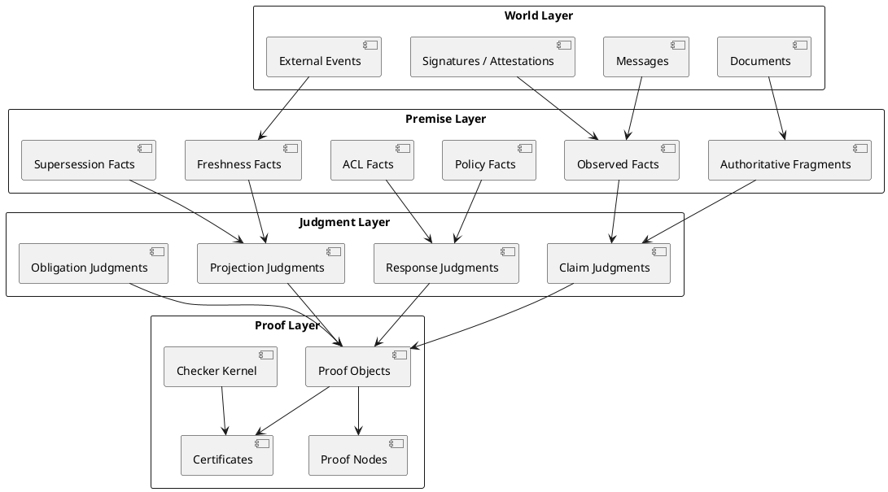
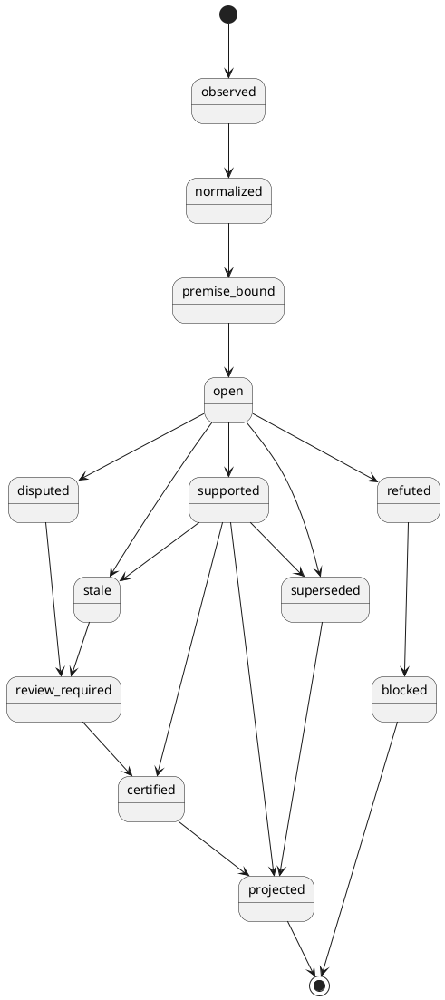
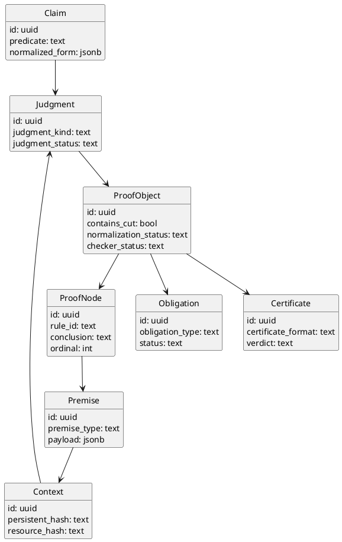

# MEVP / EPCP v0.2 — Proof-Theoretic Foundation

- **Title:** **MEVP / EPCP v0.2**
- **Expansion:** **Message Evidence Validation Protocol / Evidence & Policy Control Plane**
- **Subtitle:** **proof-theoretic foundation**
- **Status:** Draft for architecture review
- **Implementation authority:** Architecture-review foundation draft only
- **Date:** 2026-03-25
- **Context:** CollabSphere / enterprise messaging, evidence, provenance, retrieval, agent runtime
- **Document type:** protocol spec / formal foundation draft
- **Cross-track guardrail:** See [Proof-Theory Research Status Matrix](../matrix/proof-theory-research-status-matrix.md)
- **Modal language:** **MUST / SHOULD / MAY** are used in the normative sense

---

## 1. Executive decision

This document introduces the **proof-theoretic layer** for MEVP / EPCP.

Key decision:

1. The system **MUST NOT** be treated as a source of truth.
2. The system **MUST** be treated as a **machine-checkable system of claim justification**.
3. The protocol **MUST** distinguish:
   - **world truth**;
   - **external premises / attestations / observations**;
   - **derivability of a claim from the current context**;
   - **policy-level admissibility of a claim and an action**.
4. The result of protocol operation is not a “truth score,” but a **judgment** + **proof object / certificate** + **open obligations** if the proof is incomplete.
5. The base formalism of v0.2 **MUST** be small, constructive, and checkable, rather than a universal formal model of the world.

Resulting target formulation:

> **MEVP / EPCP v0.2 is a machine-checkable system for claim justification based on provenance, controlled external premises, formal inference rules, and policy constraints.**

Status and namespace note:

- this document is a foundation draft for architecture review, not an adopted
  repository runtime law;
- `proof certificate` in this document means a MEVP / EPCP protocol-level
  justification artifact family;
- it is not automatically the same schema family as
  `certificate-format-v1`;
- the relation between MEVP / EPCP proof certificates and the Hilbert
  benchmark certificate family is not yet fixed.

---

## 2. Design goal

v0.1 defined the control plane for:

- real-time validation;
- provenance;
- adjudication;
- controlled reindex;
- improvement loop.

v0.2 adds a new layer:

- **judgments**;
- **proof objects**;
- **proof certificates**;
- **sequent-style calculus**;
- **the separation between premises, derived claims, and policy decisions**.

The goal of v0.2:

1. make every significant decision **provable or unprovable in an explicit sense**;
2. represent explanation as an **object of derivation**, not as arbitrary text;
3. create a foundation for a future small proof checker;
4. leave room for a later-stage bridge to proof assistants and external proof-certificate formats.

---

## 3. Theoretical basis

### 3.1. Provenance as explicit premise layer

The base provenance layer builds on the **Entity / Activity / Agent** model from W3C PROV. W3C defines provenance as information about entities, activities, and people/agents involved in producing data that can be used to assess quality, reliability, and trustworthiness. citeturn401958view0turn401958view1

### 3.2. Formal semantics for provenance-compatible reasoning

For MEVP / EPCP, this matters not for its own sake, but because **PROV-SEM** provides a model-theoretic semantics for PROV by treating PROV-DM statements as atomic formulas of first-order logic and constraints/inferences as a first-order theory. This means the provenance layer already has a formal basis for logical reasoning. citeturn401958view1

### 3.3. Structural proof theory as calculus discipline

As a proof-theoretic foundation, v0.2 takes **structural proof theory** in the style of Negri and von Plato as its reference point:

- sequent calculus as a convenient carrier for explicit context;
- admissibility of structural rules;
- cut elimination;
- analyticity of proofs;
- the ability to translate axioms into rules without losing cut elimination in suitable cases. citeturn401958view2turn401958view3

### 3.4. Constructive reading of judgments

v0.2 adopts a **constructive / intuitionistic bias**. The reason is simple: the system should not declare strong disjunctive conclusions without constructive witness. The Curry–Howard / Propositions as Types line is useful here as an engineering principle:

- propositions ↔ types;
- proofs ↔ programs;
- proof simplification ↔ program evaluation.

This makes the proof object not only a logical explanation, but also a potentially executable / checkable artifact.

### 3.5. Proof certificates as portable evidence

v0.2 follows the idea of **Foundational Proof Certificates**: separating proof evidence from a specific prover runtime and giving proof evidence a formal semantics so that a trusted checker can verify it. This is especially important for inter-system exchange of decisions and for the future external protocol/API surface. citeturn608178search7turn608178search20

---

## 4. Explicit non-goals

v0.2 does **not** attempt to:

1. formally prove the truth of the real world without external premises;
2. automatically turn natural language into full formulas without an intermediate claim-normalization layer;
3. build a full general-purpose theorem prover;
4. introduce dependent type theory as a mandatory MVP core;
5. conflate proof-theoretic admissibility with retrieval relevance score.

---

## 5. Core architectural distinction

MEVP / EPCP v0.2 separates four distinct layers:

### 5.1. World layer

The real world, documents, messages, external events, signatures, timestamps, and ACL facts.

### 5.2. Premise layer

Normalized external premises:

- `observed_fact`
- `signed_attestation`
- `authoritative_fragment`
- `policy_fact`
- `acl_fact`
- `freshness_fact`
- `supersession_fact`
- `contradiction_fact`

### 5.3. Judgment layer

Judgments constructed from premises by formal rules:

- `claim_supported`
- `claim_disputed`
- `claim_refuted`
- `claim_open`
- `response_sendable`
- `response_blocked`
- `projection_indexable`
- `projection_blocked`

### 5.4. Proof layer

Proof objects:

- derivation tree;
- references to premises;
- rule applications;
- open obligations;
- certificate envelope;
- checker result.

---

## 6. Semantic stance

### 6.1. Not truth, but warrant to assert

The basic semantic unit of the protocol is not `Truth(P)`, but **`Warrant(Γ, P, k)`**, where:

- `Γ` is the current premise context;
- `P` is a normalized claim;
- `k` is the judgment class.

In practical terms, this means:

- the system does **not** assert “`P` is absolutely true”;
- the system asserts “from context `Γ`, under rules `R`, it is derivable that `P` has status `k`.”

### 6.2. Three-way discipline

The protocol **MUST** distinguish at least three cases:

1. `derivable` — the claim is derivable;
2. `refuted` — the claim is refuted;
3. `open` — the claim is not derivable from the current premises, but is also not refuted.

`not derivable` **MUST NOT** automatically mean `false`.

### 6.3. Policy and evidence are separate but composable

Evidence status and policy status are different layers:

- `claim_supported` does not yet mean `response_sendable`;
- `claim_open` does not always mean `response_blocked` if the mode allows a cautious answer;
- `claim_supported` may be blocked by policy or ACL.

---

## 7. Syntax and core objects

### 7.1. Identifiers

All core objects **MUST** have stable identifiers:

- `message_id`
- `claim_id`
- `premise_id`
- `judgment_id`
- `proof_object_id`
- `proof_certificate_id`
- `rule_id`
- `context_id`

### 7.2. Claim syntax

At the level of normalized representation, a claim is defined as:

```text
Claim := predicate(term, ..., term)
       | not Claim
       | and(Claim, Claim)
       | or(Claim, Claim)
       | implies(Claim, Claim)
       | modal(Tag, Claim)
```

Where `Tag` in v0.2 must support at least:

- `Observed`
- `Attested`
- `Authoritative`
- `Current`
- `Permitted`
- `Disputed`
- `Revoked`

### 7.3. Premise syntax

```text
Premise := fact(FactAtom)
         | provenance(ProvAtom)
         | policy(PolicyAtom)
         | acl(ACLAtom)
         | freshness(FreshAtom)
         | contradiction(ContrAtom)
         | supersession(SuperAtom)
         | token(TokenAtom)
```

### 7.4. Context split

v0.2 uses two contexts:

- `Π` — **persistent context**
- `Λ` — **resource / linear-like context**

#### Persistent context `Π`

Contains premises that can be reused:

- provenance facts;
- authoritative facts;
- ACL facts;
- policy facts;
- freshness facts;
- normalized claims;
- contradiction links.

#### Resource context `Λ`

Contains one-time or consumable elements:

- approval tokens;
- escalation permits;
- one-time obligations;
- workflow transition grants.

If the resource layer is not needed in a particular subsystem, `Λ` MAY be empty. But the v0.2 formalism keeps it in order to support future linear / affine behavior.

---

## 8. Judgment forms

Basic judgment form:

```text
Π ; Λ ⊢ J
```

Where `J` is one of the following judgment forms.

### 8.1. Claim judgments

```text
Π ; Λ ⊢ claim(c) : supported
Π ; Λ ⊢ claim(c) : disputed
Π ; Λ ⊢ claim(c) : refuted
Π ; Λ ⊢ claim(c) : open
Π ; Λ ⊢ claim(c) : stale
Π ; Λ ⊢ claim(c) : superseded
```

### 8.2. Response judgments

```text
Π ; Λ ⊢ response(r) : sendable
Π ; Λ ⊢ response(r) : cautious_sendable
Π ; Λ ⊢ response(r) : blocked
Π ; Λ ⊢ response(r) : review_required
```

### 8.3. Projection judgments

```text
Π ; Λ ⊢ projection(p) : indexable
Π ; Λ ⊢ projection(p) : quarantine
Π ; Λ ⊢ projection(p) : supersede_old
Π ; Λ ⊢ projection(p) : blocked
```

### 8.4. Obligation judgments

```text
Π ; Λ ⊢ obligation(o) : open
Π ; Λ ⊢ obligation(o) : discharged
```

### 8.5. Checker judgments

```text
Π ; Λ ⊢ proof(π) : valid
Π ; Λ ⊢ proof(π) : invalid
Π ; Λ ⊢ certificate(κ) : accepted
Π ; Λ ⊢ certificate(κ) : rejected
```

---

## 9. Sequent-style calculus v0.2

### 9.1. General notes

1. v0.2 chooses a **single-conclusion constructive core**.
2. A multi-conclusion layer MAY be added in the future for special audit / reviewer tools.
3. Structural rules over `Π` are treated as admissible by design;
   over `Λ` they are constrained by resource discipline.
4. The main engineering goal is not completeness with respect to the “world,” but:
   - checkability;
   - explainability;
   - stable derivation objects;
   - explicit failure/open-goal handling.

### 9.2. Core axioms

#### AX-PREMISE

If `p ∈ Π`, then:

```text
Π, p ; Λ ⊢ premise(p) : available
```

#### AX-TOKEN

If `t ∈ Λ`, then:

```text
Π ; Λ, t ⊢ token(t) : available
```

#### AX-CLAIM-NORM

If claim `c` is correctly normalized and linked to the source artifact:

```text
Π, normalized(c), bound_to_source(c) ; Λ ⊢ claim(c) : open
```

### 9.3. Evidence support rules

#### R-SUPPORT-AUTH

```text
Π, evidence(e,c), authoritative(e), current(e), acl_ok(e)
; Λ ⊢ claim(c) : supported
```

#### R-SUPPORT-MULTI

```text
Π, evidence(e1,c), evidence(e2,c), independent(e1,e2), trusted(e1), trusted(e2), acl_ok(e1), acl_ok(e2)
; Λ ⊢ claim(c) : supported
```

#### R-SUPPORT-ATTEST

```text
Π, attests(a,c), signer_trusted(a), signature_valid(a), current(a)
; Λ ⊢ claim(c) : supported
```

### 9.4. Negative and conflict rules

#### R-DISPUTE-CONFLICT

```text
Π, supports(e1,c), contradicts(e2,c), trusted(e1), trusted(e2), acl_ok(e1), acl_ok(e2)
; Λ ⊢ claim(c) : disputed
```

#### R-REFUTE-AUTH

```text
Π, authoritative_negation(e,c), current(e), acl_ok(e)
; Λ ⊢ claim(c) : refuted
```

#### R-STALE

```text
Π, evidence(e,c), stale(e)
; Λ ⊢ claim(c) : stale
```

#### R-SUPERSEDED

```text
Π, evidence(e_old,c), superseded_by(e_old,e_new), current(e_new)
; Λ ⊢ claim(c) : superseded
```

### 9.5. Policy and messaging rules

#### R-SEND-FACTUAL

```text
Π ; Λ ⊢ claim(c) : supported
Π ; Λ ⊢ citations(c) : complete
Π ; Λ ⊢ policy(c) : allowed
--------------------------------
Π ; Λ ⊢ response(r) : sendable
```

#### R-SEND-CAUTIOUS

```text
Π ; Λ ⊢ claim(c) : open
Π ; Λ ⊢ policy(c) : cautious_allowed
-------------------------------------
Π ; Λ ⊢ response(r) : cautious_sendable
```

#### R-SEND-BLOCKED-DISPUTED

```text
Π ; Λ ⊢ claim(c) : disputed
---------------------------
Π ; Λ ⊢ response(r) : review_required
```

#### R-SEND-BLOCKED-POLICY

```text
Π ; Λ ⊢ policy(c) : forbidden
-----------------------------
Π ; Λ ⊢ response(r) : blocked
```

### 9.6. Index projection rules

#### R-INDEX-CURRENT

```text
Π ; Λ ⊢ claim(c) : supported
Π ; Λ ⊢ provenance(c) : complete
Π ; Λ ⊢ freshness(c) : current
--------------------------------
Π ; Λ ⊢ projection(p) : indexable
```

#### R-INDEX-QUARANTINE

```text
Π ; Λ ⊢ claim(c) : disputed
---------------------------
Π ; Λ ⊢ projection(p) : quarantine
```

#### R-INDEX-SUPERSEDE

```text
Π ; Λ ⊢ claim(c_new) : supported
Π ; Λ ⊢ claim(c_old) : superseded
---------------------------------
Π ; Λ ⊢ projection(p) : supersede_old
```

### 9.7. Resource rules (optional linear-like discipline)

#### R-APPROVAL-CONSUME

```text
Π ; Λ, approval_token(t) ⊢ response(r) : review_required
--------------------------------------------------------
Π ; Λ ⊢ response(r) : sendable
```

This rule specifically shows that some workflow grants can be consumed.

---

## 10. Structural requirements

### 10.1. Admissibility targets

v0.2 states the following design targets:

1. **Weakening over `Π` SHOULD** be admissible.
2. **Exchange over `Π` SHOULD** be admissible.
3. **Contraction over `Π` SHOULD** be admissible.
4. For `Λ`, contraction **MUST NOT** be assumed by default.
5. For `Λ`, weakening and exchange **MAY** depend on the resource class.

### 10.2. Cut discipline

1. v0.2 allows internal intermediate lemmas as an engineering tool.
2. But the protocol **SHOULD** strive for a cut-light / cut-eliminable presentation for explainable certificates.
3. If cut is used, the proof object **MUST** mark this explicitly:
   - `contains_cut = true`
   - `cut_formula = ...`
   - `normalization_status = pending|normalized|not_normalizable`

### 10.3. Subformula-oriented explanation

For user-facing and reviewer-facing explainability, the proof exporter **SHOULD** build the most analytic form of derivation possible, using only:

- the goal;
- subformulas of the goal;
- premises;
- necessary rule annotations.

---

## 11. Proof object schema

### 11.1. Design intent

A proof object is not a textual explanation and not a runtime log. It is a **machine-checkable derivation artifact**.

### 11.2. Top-level schema

```json
{
  "proof_object_id": "uuid",
  "protocol_version": "MEVP/EPCP-v0.2",
  "judgment_id": "uuid",
  "conclusion": {
    "context_id": "uuid",
    "persistent_context_hash": "sha256",
    "resource_context_hash": "sha256",
    "judgment": "claim(c123):supported"
  },
  "root_node_id": "uuid",
  "nodes": [],
  "premise_refs": [],
  "open_obligations": [],
  "contains_cut": false,
  "normalization_status": "normalized",
  "checker_status": "unchecked",
  "checker_version": null,
  "created_at": "RFC3339"
}
```

### 11.3. Proof node schema

```json
{
  "proof_node_id": "uuid",
  "parent_node_id": "uuid|null",
  "rule_id": "R-SUPPORT-AUTH",
  "premise_node_ids": ["uuid", "uuid"],
  "premise_refs": ["premise-uuid-1", "premise-uuid-2"],
  "local_context_delta": {
    "add_persistent": [],
    "consume_resources": []
  },
  "conclusion": "claim(c123):supported",
  "annotations": {
    "evidence_refs": ["fragment-1", "fragment-2"],
    "policy_refs": ["policy-7"],
    "explanation": "authoritative current evidence supports claim"
  }
}
```

### 11.4. Open obligation schema

```json
{
  "obligation_id": "uuid",
  "type": "missing_counterevidence_check|human_review|citation_completion|freshness_refresh",
  "target": "claim(c123)",
  "severity": "low|medium|high|critical",
  "status": "open|discharged|waived",
  "created_at": "RFC3339"
}
```

### 11.5. Proof certificate envelope

```json
{
  "proof_certificate_id": "uuid",
  "certificate_format": "mevp-fpc-v0",
  "proof_object_id": "uuid",
  "issuer": "mevp-checker",
  "issuer_version": "0.2.0",
  "verdict": "accepted|rejected|inconclusive",
  "signature": "optional detached signature",
  "issued_at": "RFC3339"
}
```

---

## 12. Checker model

### 12.1. Kernel-first requirement

v0.2 **MUST** be designed around a small checker kernel that verifies:

1. well-formedness judgments;
2. admissibility of rule applications;
3. existence of premise refs;
4. correspondence between the proof tree and the declared conclusion;
5. correctness of consumption rules for `Λ`;
6. consistency flags for provenance/policy bindings.

### 12.2. Separation of concerns

- the scorer may be probabilistic;
- the extractor may be LLM-assisted;
- the normalizer may be heuristic;
- the **checker MUST** be as deterministic as possible.

### 12.3. Checker outputs

```text
accepted
rejected
inconclusive
malformed
missing-premise
rule-mismatch
resource-violation
```

---

## 13. State machine

### 13.1. Claim adjudication state machine

```text
observed
  -> normalized
  -> premise_bound
  -> open
  -> supported | disputed | refuted | stale | superseded
  -> review_required | certified
  -> projected | blocked
```

### 13.2. Response state machine

```text
draft
  -> judgment_pending
  -> sendable
  -> cautious_sendable
  -> review_required
  -> blocked
  -> sent
```

### 13.3. Proof state machine

```text
constructed
  -> normalized
  -> checked
  -> accepted | rejected | inconclusive
  -> certified
```

### 13.4. Normative constraints

1. `sent` **MUST NOT** be reached directly from `draft`.
2. `certified` **MUST NOT** be reached without `checked`.
3. `projected` **MUST NOT** occur for `refuted`, except for special quarantine/debug channels.
4. `supported` **MAY** transition to `superseded` or `stale` when new premises arrive.

---

## 14. Event taxonomy

### 14.1. Message events

- `message.observed`
- `message.normalized`
- `message.claims_extracted`
- `message.response_drafted`
- `message.response_sent`
- `message.response_blocked`

### 14.2. Premise events

- `premise.bound`
- `premise.attested`
- `premise.revoked`
- `premise.superseded`
- `premise.freshness_changed`

### 14.3. Judgment events

- `judgment.created`
- `judgment.updated`
- `judgment.supported`
- `judgment.disputed`
- `judgment.refuted`
- `judgment.open`
- `judgment.review_required`

### 14.4. Proof events

- `proof.constructed`
- `proof.normalized`
- `proof.checked`
- `proof.accepted`
- `proof.rejected`
- `proof.inconclusive`
- `certificate.issued`

### 14.5. Projection events

- `projection.indexable`
- `projection.quarantined`
- `projection.superseded`
- `projection.blocked`
- `index.updated`

### 14.6. Improvement loop events

- `incident.detected`
- `error.harvested`
- `eval_case.created`
- `rule_version.proposed`
- `rule_version.approved`
- `rule_version.promoted`
- `rule_version.rolled_back`

---

## 15. SQL schema draft

> Below is a draft schema. It expresses the canonical store, not the retrieval projection.

```sql
create table mevp_claims (
    id uuid primary key,
    tenant_id uuid not null,
    message_id uuid not null,
    predicate text not null,
    normalized_form jsonb not null,
    source_span jsonb null,
    created_at timestamptz not null default now()
);

create table mevp_premises (
    id uuid primary key,
    tenant_id uuid not null,
    premise_type text not null,
    payload jsonb not null,
    provenance_ref jsonb null,
    authority_tier text null,
    freshness_status text null,
    is_revoked boolean not null default false,
    superseded_by uuid null,
    created_at timestamptz not null default now()
);

create table mevp_contexts (
    id uuid primary key,
    tenant_id uuid not null,
    persistent_hash text not null,
    resource_hash text not null,
    created_at timestamptz not null default now()
);

create table mevp_context_premises (
    context_id uuid not null references mevp_contexts(id) on delete cascade,
    premise_id uuid not null references mevp_premises(id) on delete cascade,
    context_kind text not null check (context_kind in ('persistent','resource')),
    primary key (context_id, premise_id, context_kind)
);

create table mevp_judgments (
    id uuid primary key,
    tenant_id uuid not null,
    claim_id uuid null references mevp_claims(id),
    context_id uuid not null references mevp_contexts(id),
    judgment_kind text not null,
    judgment_status text not null,
    scorer_version text null,
    rule_set_version text not null,
    checker_status text not null default 'unchecked',
    created_at timestamptz not null default now(),
    updated_at timestamptz not null default now()
);

create table mevp_inference_rules (
    id text primary key,
    rule_family text not null,
    description text not null,
    arity int not null,
    is_resource_consuming boolean not null default false,
    is_active boolean not null default true,
    version text not null
);

create table mevp_proof_objects (
    id uuid primary key,
    tenant_id uuid not null,
    judgment_id uuid not null references mevp_judgments(id) on delete cascade,
    root_node_id uuid null,
    contains_cut boolean not null default false,
    normalization_status text not null default 'pending',
    checker_status text not null default 'unchecked',
    checker_version text null,
    proof_payload jsonb not null,
    created_at timestamptz not null default now()
);

create table mevp_proof_nodes (
    id uuid primary key,
    proof_object_id uuid not null references mevp_proof_objects(id) on delete cascade,
    parent_node_id uuid null references mevp_proof_nodes(id) on delete cascade,
    rule_id text not null references mevp_inference_rules(id),
    conclusion text not null,
    annotations jsonb null,
    ordinal int not null
);

create table mevp_proof_node_premises (
    proof_node_id uuid not null references mevp_proof_nodes(id) on delete cascade,
    premise_id uuid null references mevp_premises(id),
    premise_node_id uuid null references mevp_proof_nodes(id),
    primary key (proof_node_id, premise_id, premise_node_id)
);

create table mevp_obligations (
    id uuid primary key,
    tenant_id uuid not null,
    judgment_id uuid null references mevp_judgments(id) on delete cascade,
    obligation_type text not null,
    severity text not null,
    status text not null,
    payload jsonb not null,
    created_at timestamptz not null default now(),
    closed_at timestamptz null
);

create table mevp_certificates (
    id uuid primary key,
    tenant_id uuid not null,
    proof_object_id uuid not null references mevp_proof_objects(id) on delete cascade,
    certificate_format text not null,
    issuer text not null,
    issuer_version text not null,
    verdict text not null,
    signature bytea null,
    issued_at timestamptz not null default now()
);

create table mevp_events (
    id uuid primary key,
    tenant_id uuid not null,
    event_type text not null,
    subject_type text not null,
    subject_id uuid null,
    payload jsonb not null,
    created_at timestamptz not null default now()
);

create index idx_mevp_claims_message_id on mevp_claims(message_id);
create index idx_mevp_premises_type on mevp_premises(premise_type);
create index idx_mevp_judgments_claim_id on mevp_judgments(claim_id);
create index idx_mevp_judgments_kind_status on mevp_judgments(judgment_kind, judgment_status);
create index idx_mevp_events_type_created_at on mevp_events(event_type, created_at desc);
```

---

## 16. Retrieval projection rules

The vector/search layer **MUST** receive only a projection derived from proof-governed canonical state.

### 16.1. Minimal payload

```json
{
  "tenant_id": "uuid",
  "claim_id": "uuid",
  "judgment_status": "supported|disputed|open|stale|superseded",
  "authority_tier": "authoritative|trusted|supporting|weak",
  "freshness_bucket": "current|aging|stale",
  "has_certificate": true,
  "certificate_verdict": "accepted",
  "is_current": true,
  "source_refs": ["fragment-1", "fragment-2"]
}
```

### 16.2. Hard constraints

1. `refuted` claims **MUST NOT** appear in the normal retrieval surface.
2. `disputed` claims **SHOULD** appear only in review / diagnostic surfaces or with an explicit disputed flag.
3. `open` claims **MAY** appear in discovery surfaces, but not in strict factual surfaces.

---

## 17. PlantUML

### 17.1. Protocol layering diagram



### 17.2. Claim adjudication state machine



### 17.3. Proof object model



---

## 18. Implementation strategy

### 18.1. Phase 1 — formal core only

First, implement:

- claim normalization;
- premise typing;
- judgment objects;
- small rule registry;
- proof object construction;
- deterministic checker kernel;
- canonical persistence.

### 18.2. Phase 2 — export and inspection

Then:

- certificate export;
- reviewer UI for proof tree;
- explain endpoint;
- projection gating by judgment status.

### 18.3. Phase 3 — stronger formalization

Only after stabilization:

- richer modal judgments;
- limited quantified claims;
- more explicit resource logic;
- bridge to external proof tooling / assistants for selected kernels.

---

## 19. Hard architectural rules

1. Production outputs **MUST NOT** become axioms.
2. External premises **MUST** be typed and provenance-bound.
3. Every high-impact outgoing response **SHOULD** have a proof object or explicit open obligations.
4. The checker **MUST** be more deterministic than the extractor/scorer.
5. Proof objects **MUST** survive reindex and scorer upgrades.
6. The retrieval layer **MUST NOT** hide disagreement, supersession, and stale status.
7. `open` and `refuted` **MUST** remain distinct states.
8. Reviewer override **MUST** be a separate typed premise, not a silent mutation of historical data.

---

## 20. Open questions

1. How early should resource-sensitive rules be introduced in the production path?
2. Is a multi-conclusion calculus needed for reviewer/debug tools?
3. Which classes of premises may be treated as axiomatic within a specific tenant scope?
4. What minimal certificate format should be made portable across services?
5. Is a separate modal layer needed for time, signatures, and revocation?
6. Which later-stage bridge would be more useful: a checker-only approach or export into a Lean/Rocq-compatible intermediate representation?

---

## 21. Recommended terminology

Use the following wording:

- **not** `truth engine`
- **not** `truth score`
- **yes** `evidence judgment`
- **yes** `warrant to assert`
- **yes** `proof object`
- **yes** `certificate`
- **yes** `open obligation`
- **yes** `policy-governed assertion`
- **yes** `proof-carrying evidence`

---

## 22. References

### Normative / conceptual basis

1. **W3C PROV Overview** — provenance as information about entities, activities, and agents used to assess quality, reliability, and trustworthiness. citeturn401958view0
2. **W3C PROV-SEM** — the model-theoretic semantics of PROV via atomic formulas and first-order theory. citeturn401958view1
3. **Negri, von Plato — Structural Proof Theory** — sequent calculus, admissibility of structural rules, cut elimination, constructive reasoning, and adding axioms via rules. citeturn401958view2turn401958view3
4. **Foundational Proof Certificates** — the idea of a formal semantics for proof evidence and portable proof certificates. citeturn608178search7turn608178search20

### Local discussion basis

5. **Philip Wadler — Propositions as Types** — the Curry–Howard line: propositions ↔ types, proofs ↔ programs, simplification ↔ evaluation.
6. Discussion of MEVP / EPCP v0.1 and the extension of the protocol to a proof-theoretic layer.

---

## 23. Final position

v0.2 establishes the following thesis:

> **MEVP / EPCP is not a system of truth. It is a system of formally governed and machine-checkable justification for claims, responses, and index projections.**

In this framing, the protocol can evolve into:

- trusted checker for enterprise evidence;
- proof-carrying messaging substrate;
- explainable policy layer for agent communication;
- formal audit surface for retrieval and knowledge governance.
