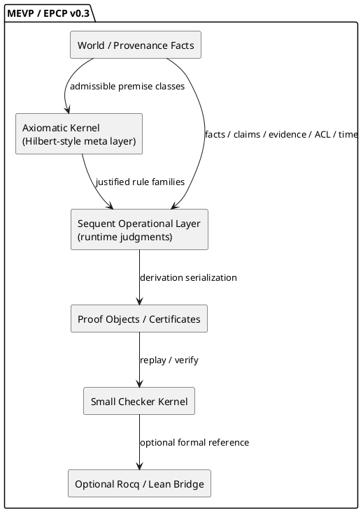
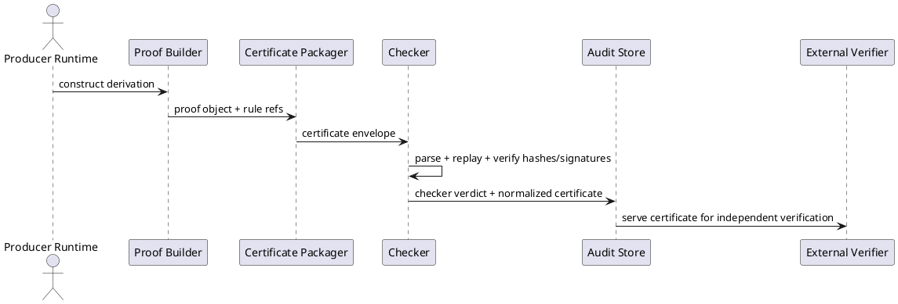

# MEVP / EPCP v0.3 — Axiomatic Kernel + Sequent Operational Layer + Certificate Checker Roadmap

- **Title:** **MEVP / EPCP v0.3**
- **Expansion:** **Message Evidence Validation Protocol / Evidence & Policy Control Plane**
- **Subtitle:** **research addendum**
- **Status:** Draft for research and architecture review
- **Implementation authority:** Research addendum / architecture direction only
- **Date:** 2026-03-25
- **Context:** CollabSphere / enterprise messaging / evidence / provenance / policy / machine-checkable justification
- **Relation to previous versions:**
  - v0.1 — protocol spec
  - v0.2 — proof-theoretic foundation
- **Cross-track guardrail:** See [Proof-Theory Research Status Matrix](../matrix/proof-theory-research-status-matrix.md)
- **Normative modality:** **MUST / SHOULD / MAY** are used in the normative sense

---

## 1. Executive decision

v0.3 establishes the research decision for the proof-layer architecture.

### 1.1. Main conclusion

For MEVP / EPCP, the core **should not** be built entirely on a Hilbert-style calculus.

For MEVP / EPCP, a three-layer scheme **should** be adopted:

1. **Axiomatic kernel** — a compact **Hilbert-style / axiom-schema layer** for metatheory, axiom independence, conservative extensions, and a minimal trusted logical base.
2. **Sequent operational layer** — the primary runtime calculus for adjudication, explainability, rule application, proof search, and policy-aware reasoning.
3. **Certificate checker boundary** — a small checking boundary that accepts proof objects / certificates and independently verifies derivational correctness.

### 1.2. Key thesis of v0.3

The system **MUST NOT** be treated as a source of truth.

The system **MUST** be treated as:

> **a machine-checkable system for justifying the admissibility of claims and actions on the basis of provenance, external premises, structural calculus, and checkable proof certificates.**

### 1.3. Resulting architectural formula

**Hilbert as axiom base → Sequent as runtime calculus → Certificates as trust boundary → Optional Rocq/Lean bridge as mechanization path.**

### 1.4. Status and namespace note

Interpret this document narrowly:

- it is a research addendum and architecture-direction draft, not an adopted
  repository runtime law;
- the proposed sequent operational layer is a research target shape, not a
  production runtime decision already taken;
- `proof certificate` in this document means a MEVP / EPCP protocol-level
  justification artifact family;
- it is not automatically the same schema family as
  `certificate-format-v1`;
- the relation between MEVP / EPCP proof certificates and the Hilbert
  benchmark certificate family is not yet fixed and requires a separate bridge
  document if it is ever introduced.

---

## 2. Why this addendum exists

v0.2 established the proof-theoretic foundation, but did not separate the following sharply enough:

- **the meta-level of axioms**;
- **the operational level of proof derivation**;
- **the trust boundary** between the proof producer and the proof checker.

v0.3 adds precisely this separation.

The new document is needed in order to:

1. not conflate the **mathematical compactness** of Hilbert systems with the **operational suitability** of sequent calculi;
2. separate **proof search / proof construction** from **trusted checking**;
3. incorporate more recent research lines into the protocol:
   - hierarchy and translations among sequent-based calculi;
   - higher-level sequent rules via focusing;
   - proof-relevant timed message-passing verification;
   - certified proof checking;
   - proof-theoretic semantics / base-extension semantics;
   - selective future work on cyclic proofs and provability logic.

---

## 3. Research position

### 3.1. Hilbert systems: yes, but not as runtime

Hilbert-style systems **SHOULD** be used as:

- a minimal axiomatic foundation;
- a reference layer for axiom schemata;
- a vehicle for metatheoretic reasoning:
  - independence,
  - conservativity,
  - admissibility boundaries,
  - small trusted base.

Hilbert-style systems **SHOULD NOT** be used as the primary runtime layer for:

- real-time message adjudication;
- explicit context management;
- proof search;
- explainable derivation traces;
- evidence-local reasoning.

### 3.2. Structural / sequent proof theory: primary operational choice

Structural proof theory and sequent-style calculi **MUST** be treated as the protocol’s primary operational discipline because they are better suited for:

- an explicit context on the left and a target judgment on the right;
- rule-local explainability;
- cut elimination discipline;
- modular rule families;
- policy-aware and evidence-aware derivations;
- translations into richer or more specialized calculi later.

### 3.3. Certificates and small checker: trust boundary

Any high-impact protocol decision **SHOULD** be expressible as:

- judgment;
- proof object;
- proof certificate;
- checker verdict.

This makes it possible to separate:

- complex producer-side reasoning;
- retrieval and heuristic assistance;
- LLM-aided normalization and search;

from

- a small trusted checker.

### 3.4. Type-theoretic mechanization: later bridge, not MVP kernel

Rocq / Lean / other proof assistants **MAY** be used as:

- reference mechanization targets;
- meta-theorem validation layer;
- selected kernel verification pathway.

But they **SHOULD NOT** be the mandatory runtime core of the MVP.

---

## 4. Research basis and selection rationale

What follows is not a complete review of proof theory, but a **targeted shortlist** of directions relevant to the protocol.

### 4.1. Sources used in this addendum

| ID | Source | Relevance to v0.3 |
|---|---|---|
| R1 | Stanford Encyclopedia of Philosophy, *Intuitionistic Logic* | Hilbert-style systems, constructive bias, metatheoretic role |
| R2 | Lyon et al., *Internal and External Calculi* (arXiv 2312.03426) | hierarchy and translations among sequent-based calculi |
| R3 | Miller & Pimentel, *Higher-level rules for sequent calculus* (2024) | synthetic / higher-level rules, focusing-friendly extension path |
| R4 | Zhang et al., *Mechanizing a Proof-Relevant Logical Relation for Timed Message-Passing Protocols* (arXiv 2511.19521) | timed message-passing and proof-relevant evidence for protocols |
| R5 | Desmartin et al., *A Certified Proof Checker for Deep Neural Network Verification in Imandra* (arXiv 2405.10611) | certificate checking boundary and independent checking principle |
| R6 | Russian Science Foundation project 20-41-05002 | cyclic proofs, non-well-founded proofs, provability logic as research frontier |
| R7 | Barroso-Nascimento et al., *A Proof-Theoretic Approach to the Semantics of Classical Linear Logic* | base-extension semantics and proof-theoretic semantics |
| R8 | W3C PROV-SEM / PROV-CONSTRAINTS | first-order semantics of provenance facts |
| R9 | Rocq reference manual | machine-checked proofs and small kernel model |
| R10 | Lean official site | formally verified code and theorem proving bridge |
| R11 | MCP specification | external protocol surface for tool/data integration |
| R12 | OpenTelemetry GenAI semantic conventions | trace/event model for protocol telemetry |
| R13 | OpenLineage object model | jobs/runs/datasets/facets model for event lineage |

### 4.2. Result of the review

**Adopt now**:

- axiomatic kernel as meta-layer;
- sequent operational layer as runtime;
- proof objects and certificates;
- small checker boundary;
- proof-relevant message and time-aware obligations at the judgment level.

**Adopt later / research track**:

- cyclic proofs;
- provability logic;
- base-extension semantics deeper integration;
- richer modal / linear / temporal refinements;
- mechanized kernel bridge into Rocq / Lean.

**Do not adopt as core runtime now**:

- Hilbert-only operational engine;
- LLM as final checker;
- full dependent-type runtime core;
- unrestricted cyclic proof search.

---

## 5. Normative architectural decisions inside the v0.3 research proposal

### 5.1. Decision A — split the formal stack

The protocol stack **MUST** be split into:

1. **Axiomatic kernel**;
2. **Sequent operational layer**;
3. **Certificate checker boundary**.

### 5.2. Decision B — keep the axiom base tiny

Axiomatic kernel **MUST** remain small.

It **MUST NOT** absorb domain heuristics, retrieval scoring, or policy exceptions as axioms.

Only the following belong in the axiom base:

- minimal logical schemata;
- persistent well-formedness principles;
- provenance structural invariants;
- monotonicity / admissibility principles that the system is prepared to defend mathematically;
- explicit axiom schemata for trusted external attestations.

### 5.3. Decision C — move domain action to rules, not axioms

Operational logic for:

- `claim_supported`,
- `claim_disputed`,
- `response_sendable`,
- `index_projection_admissible`,
- `review_required`,
- `policy_blocked`

**MUST** live in the sequent operational layer, not in the Hilbert kernel.

### 5.4. Decision D — certificate first for high-value decisions

All high-impact protocol decisions **SHOULD** be exportable as certificates.

At minimum, certificates **SHOULD** be required for:

- externalized response approvals;
- policy overrides;
- contradiction resolution outcomes;
- reindex promotions;
- cross-org evidence-based assertions.

---

## 6. Layered formal architecture

## 6.1. Layer 0 — world and provenance facts

This layer contains:

- raw messages;
- normalized claims;
- documents and fragments;
- timestamps;
- signatures and attestations;
- ACL facts;
- human review events;
- contradiction/corroboration records.

This layer is **not** yet proof theory. It is the premise universe.

## 6.2. Layer 1 — axiomatic kernel

This layer defines:

- core logical schemata;
- provenance integrity schemata;
- admissibility boundaries;
- trusted external premise classes.

The kernel is deliberately small and stable.

## 6.3. Layer 2 — sequent operational layer

This layer performs runtime reasoning using explicit contexts and judgments.

This is the main place for:

- adjudication;
- policy-sensitive reasoning;
- contradiction handling;
- open obligation tracking;
- decision explanation.

## 6.4. Layer 3 — proof objects and certificates

This layer serializes derivations into machine-checkable artifacts.

## 6.5. Layer 4 — checker kernel

This layer replays or validates the proof object against:

- the declared rule set;
- axiom base;
- context references;
- certificate schema;
- signature and integrity constraints.

## 6.6. Layer 5 — optional mechanization bridge

This layer is optional and future-oriented:

- Rocq/Lean export;
- theorem-level verification of kernel properties;
- verified normalization or replay components.

---

## 7. Axiomatic kernel

## 7.1. Purpose

The axiomatic kernel exists to provide:

- a minimal trusted formal base;
- reference semantics for rule families;
- a place to state meta-properties;
- an anchor for certificate checking.

## 7.2. Scope of the kernel

The kernel **MUST** remain abstract enough that domain-specific rules can be compiled into or justified against it, but not directly embedded as arbitrary axioms.

## 7.3. Kernel families

### K0. Structural identity family

Purpose:

- reflexive identity / persistence principles;
- stability of identical judgments under the same context.

### K1. Provenance well-formedness family

Purpose:

- only well-bound entities, activities, agents, messages, claims and evidence references can participate in a derivation;
- malformed or orphan references cannot enter the trusted proof boundary.

### K2. Attestation introduction family

Purpose:

- formal admission of externally trusted attestations into the premise space;
- explicit separation between **observed**, **attested**, **derived**, and **review-overridden** facts.

### K3. Temporal validity family

Purpose:

- time-bounded or freshness-bounded premises are explicit;
- stale premises are not silently reused.

### K4. Policy boundary family

Purpose:

- distinguish factual support from policy permission;
- forbid collapsing `supported` into `sendable` without policy steps.

### K5. Resource / obligation family

Purpose:

- allow later refinement toward linear or affine obligations;
- encode consumable approvals, one-shot grants, or review tokens.

## 7.4. What the kernel must not do

The kernel **MUST NOT** contain:

- retrieval ranking heuristics;
- LLM confidence signals as axioms;
- mutable product policy as timeless truths;
- contradiction resolution shortcuts;
- direct “truth score” axioms.

## 7.5. Kernel format

v0.3 recommends representing the kernel in two synchronized forms:

1. **human-readable axiom catalog**;
2. **machine-readable axiom schema registry**.

Example machine-readable registry entry:

```json
{
  "axiom_id": "K4_POLICY_SEPARATION",
  "version": "0.3.0",
  "kind": "schema",
  "statement": "supported(c) does not entail sendable(r) without policy_allow(r)",
  "status": "active",
  "depends_on": ["K0_IDENTITY"],
  "notes": "Prevents collapse of factual support into action permission"
}
```

---

## 8. Sequent operational layer

## 8.1. Core form

v0.3 fixes the runtime judgment form as:

```text
Π ; Γ ; Δ ⊢ J
```

Where:

- `Π` — persistent provenance and world facts;
- `Γ` — persistent logical / policy assumptions and derived stable facts;
- `Δ` — linear or consumable obligations, tokens, or pending review resources;
- `J` — target judgment.

## 8.2. Why three contexts

A single context is too weak for the protocol.

The split exists because the system must distinguish:

- immutable or persistent provenance-bound facts;
- derived and policy assumptions;
- consumable obligations and one-shot authorizations.

This split also leaves a future path toward linear/affine refinements.

## 8.3. Judgment forms

Minimum judgment set for v0.3:

```text
Π ; Γ ; Δ ⊢ claim(c) : supported
Π ; Γ ; Δ ⊢ claim(c) : disputed
Π ; Γ ; Δ ⊢ claim(c) : refuted
Π ; Γ ; Δ ⊢ claim(c) : open
Π ; Γ ; Δ ⊢ response(r) : sendable
Π ; Γ ; Δ ⊢ response(r) : blocked
Π ; Γ ; Δ ⊢ projection(p) : indexable
Π ; Γ ; Δ ⊢ review(rv) : required
Π ; Γ ; Δ ⊢ cert(k) : valid
Π ; Γ ; Δ ⊢ obligation(o) : discharged
```

## 8.4. Operational rule families

### O1. Identity / assumption use

```text
Π ; Γ, A ; Δ ⊢ A
```

Used only where `A` is admitted into the context lawfully.

### O2. Authoritative evidence support

```text
Π, evidence(e,c), authoritative(e), current(e), scope_ok(e,c) ; Γ ; Δ ⊢ claim(c) : supported
```

### O3. Corroboration strengthening

```text
Π ; Γ ⊢ claim(c) : supported_from(e1)
Π ; Γ ⊢ claim(c) : supported_from(e2)
independent(e1,e2)
---------------------------------
Π ; Γ ; Δ ⊢ claim(c) : supported
```

### O4. Contradiction / dispute introduction

```text
Π ; Γ ⊢ claim(c) : supported_from(e1)
Π ; Γ ⊢ claim(c) : refuted_from(e2)
trusted(e1)
trusted(e2)
---------------------------------
Π ; Γ ; Δ ⊢ claim(c) : disputed
```

### O5. Open-goal introduction

```text
missing_premise(p,c)
--------------------
Π ; Γ ; Δ ⊢ claim(c) : open
```

### O6. Policy gating for response sendability

```text
Π ; Γ ; Δ ⊢ claim(c) : supported
Π ; Γ ; Δ ⊢ citations(c) : complete
Π ; Γ ; Δ ⊢ policy(r) : allowed
---------------------------------
Π ; Γ ; Δ ⊢ response(r) : sendable
```

### O7. Review requirement

```text
Π ; Γ ; Δ ⊢ claim(c) : disputed
--------------------------------
Π ; Γ ; review_token(t) ⊢ review(rv) : required
```

### O8. Projection admissibility

```text
Π ; Γ ; Δ ⊢ claim(c) : supported
Π ; Γ ; Δ ⊢ provenance(c) : bound
Π ; Γ ; Δ ⊢ freshness(c) : acceptable
--------------------------------------
Π ; Γ ; Δ ⊢ projection(p) : indexable
```

## 8.5. Cut policy

The runtime layer **SHOULD** aim for cut admissibility as a design discipline, not necessarily as a primitive exposed feature.

Practical meaning:

- hidden intermediate leaps should be minimized;
- explanations should remain local to premises and target judgments;
- proof normalization should simplify audit traces.

## 8.6. Higher-level rules

v0.3 explicitly allows **synthetic / higher-level rules** provided that:

1. they are declared and versioned;
2. they are reducible or justifiable against the lower kernel/rule base;
3. they preserve checker tractability;
4. they do not bypass policy separation.

This is the main architectural slot for domain rules such as:

- `authoritative_current_evidence`;
- `cross_org_attested_fact`;
- `contradiction_with_equal_authority`;
- `sendable_with_human_approval`.

---

## 9. Proof objects and certificate schema

## 9.1. Design goal

A proof object is the machine-serializable derivation artifact.

A certificate is the externally checkable envelope containing:

- the proof object;
- rule set version;
- kernel version;
- referenced premises;
- integrity metadata.

## 9.2. Proof object requirements

A proof object **MUST**:

- identify every rule application;
- identify every premise source;
- identify every consumed obligation;
- identify the final judgment;
- be replayable by a checker without consulting opaque internal model state.

## 9.3. Canonical proof node schema

```json
{
  "node_id": "pn_0001",
  "rule_id": "O6_POLICY_SENDABLE",
  "premise_nodes": ["pn_0002", "pn_0003", "pn_0004"],
  "context": {
    "pi_refs": ["prov_msg_128", "evidence_991"],
    "gamma_refs": ["claim_443_supported", "citation_set_443_complete"],
    "delta_refs": []
  },
  "conclusion": {
    "judgment": "response(r_128):sendable"
  },
  "evidence_refs": ["fragment_991", "policy_rule_5"],
  "consumed_resources": [],
  "checker_hints": {
    "normal_form": true,
    "synthetic_rule": false
  }
}
```

## 9.4. Certificate envelope schema

```json
{
  "certificate_id": "cert_2026_03_25_0001",
  "protocol_version": "0.3.0",
  "kernel_version": "ak-0.3.0",
  "rulebook_version": "sol-0.3.0",
  "proof_root": "pn_0001",
  "proof_nodes": ["..."],
  "premise_manifest": {
    "messages": ["msg_128"],
    "claims": ["claim_443"],
    "evidence": ["fragment_991"],
    "attestations": [],
    "reviews": []
  },
  "hashes": {
    "proof_sha256": "...",
    "premise_manifest_sha256": "..."
  },
  "signatures": [
    {
      "signer": "checker_service",
      "alg": "ed25519",
      "sig": "..."
    }
  ]
}
```

## 9.5. Checker invariants

The checker **MUST** reject certificates if any of the following hold:

- unknown rule id;
- unknown kernel version;
- missing premise reference;
- conclusion not derivable from premises via declared rules;
- consumed resource reused illegally;
- certificate hash mismatch;
- signature mismatch;
- synthetic rule declared without admissible expansion policy.

---

## 10. Certificate checker roadmap

## 10.1. Design principle

The checker boundary exists to ensure that the final act of trust is **small, explicit, replayable and independently testable**.

## 10.2. Phase 0 — schema and replay contract

Deliverables:

- proof object schema;
- certificate envelope schema;
- rule registry format;
- checker API contract;
- negative test corpus.

Success criterion:

- every certificate can be deterministically parsed and replay-attempted.

## 10.3. Phase 1 — minimal Go checker kernel

Deliverables:

- parser;
- rule registry loader;
- replay engine for core rule families;
- hash verification;
- signature verification;
- diagnostic error model.

Scope:

- checker validates only kernel + operational core;
- no proof search;
- replay only.

Success criterion:

- high-value decisions can be checked without consulting opaque runtime internals.

## 10.4. Phase 2 — normalization and certificate compression

Deliverables:

- proof normalization;
- redundant node elimination;
- stable certificate canonicalization;
- optional synthetic-rule expansion.

Success criterion:

- certificates become transport-friendly and audit-friendly.

## 10.5. Phase 3 — mechanized reference checker model

Deliverables:

- selected kernel fragments modeled in Rocq or Lean;
- validation of soundness-critical checker routines;
- alignment between implementation and formal reference model.

Success criterion:

- at least the kernel and a subset of rule replay semantics have a formalized reference model.

## 10.6. Phase 4 — cross-system certificate exchange

Deliverables:

- MCP/API surfaces for certificate transport;
- external verifier mode;
- review UI for certificate inspection;
- long-term trust/audit archive.

Success criterion:

- decisions can be exported and verified outside the producing runtime.

---

## 11. Research roadmap beyond v0.3

## 11.1. Track A — focusing and higher-level rules

Status: **Adopt early**.

Goal:

- compile domain policies into higher-level rules while keeping the checker small.

Expected benefit:

- cleaner proof traces;
- fewer low-level bureaucratic steps;
- better domain expressivity without giant axiom sets.

## 11.2. Track B — proof-relevant timed message protocols

Status: **Adopt as major research direction**.

Goal:

- make time windows, expirations, SLAs and review deadlines first-class in judgments and proofs.

Expected benefit:

- protocol-native handling of deadlines and temporal obligations;
- stronger fit for messaging and workflow systems.

## 11.3. Track C — base-extension semantics / proof-theoretic semantics

Status: **Research integration, not MVP core**.

Goal:

- give judgment validity a proof-theoretic semantic interpretation around base support.

Expected benefit:

- stronger conceptual grounding for “support” and “open obligation” states.

## 11.4. Track D — cyclic proofs and provability logic

Status: **Phase 2–3 research only**.

Goal:

- explore recurring obligations, escalation loops, inductive/cyclic workflow structures.

Constraint:

- do not make cyclic proof search part of the first checker kernel.

## 11.5. Track E — linear / affine refinements

Status: **Promising**.

Goal:

- model consumable approvals, expiring rights, one-shot review tokens, revocations.

Constraint:

- keep the initial operational layer conservative and manually auditable.

## 11.6. Track F — theorem prover bridge

Status: **Optional, later**.

Goal:

- connect selected kernels to Rocq / Lean.

Constraint:

- proof assistant integration must serve the protocol, not dominate it.

---

## 12. Stop / go research rules

## 12.1. GO rules

A research direction may move into engineering backlog if:

1. it reduces trusted surface area; or
2. it improves locality/explainability of derivations; or
3. it improves time/resource sensitivity without exploding checker complexity; or
4. it can be expressed as a strict extension over the existing kernel and rulebook.

## 12.2. STOP rules

A research direction must stay out of core runtime if:

1. it requires global proof search with poor tractability;
2. it inflates the checker beyond a small trusted boundary;
3. it forces proof assistant dependence into the hot path;
4. it collapses policy, evidence and truth into a single score;
5. it weakens auditable replay.

---

## 13. Relation to data model and runtime

## 13.1. PostgreSQL remains the canonical ledger

The proof layer **MUST NOT** replace canonical persistence.

PostgreSQL remains the source of truth for:

- messages;
- claims;
- evidence references;
- judgments;
- rule versions;
- proof objects;
- certificates;
- checker verdicts;
- review history.

## 13.2. Vector/search index remains projection-only

Vector/search systems receive only retrieval-critical projection:

- embeddings;
- retrieval metadata;
- authority and freshness buckets;
- judgment class summaries;
- certificate availability flags.

Full proof objects **SHOULD NOT** live as the sole source in vector/search storage.

## 13.3. Telemetry and lineage model

Protocol runs **SHOULD** emit:

- OpenTelemetry-compatible traces/events;
- OpenLineage-style run/job/dataset observations;
- checker replay events;
- certificate issuance and verification events.

---

## 14. PlantUML diagrams

## 14.1. Layered architecture diagram



## 14.2. Certificate checking sequence



---

## 15. Proposed deliverables after v0.3

### 15.1. Immediate next artifacts

1. `MEVP_EPCP_v0.3_rulebook_draft.md`
2. `proof_object.schema.json`
3. `certificate_envelope.schema.json`
4. `checker_error_model.md`
5. `proof_checker_kernel_go_draft.md`
6. `mevp_epcp_v0.3_research_addendum.puml`

### 15.2. Recommended engineering order

1. stabilize judgment vocabulary;
2. stabilize axiom schema registry;
3. implement rule registry;
4. implement replay-only checker;
5. add normalization and certificate signing;
6. add external verification surface.

---

## 16. Final position

v0.3 formalizes the following strategic choice:

- **Hilbert system is worth using, but in the right place**;
- **the right place is the axiomatic kernel, not the runtime engine**;
- **the runtime engine should be sequent-oriented and context-explicit**;
- **trust should terminate at a small certificate checker boundary**.

This is the most plausible path that balances:

- proof-theoretic rigor;
- operational explainability;
- protocol engineering practicality;
- future mechanization;
- enterprise auditability.

---

## 17. Source basis

Below is the public source basis used for the research framing of this addendum.

1. **Stanford Encyclopedia of Philosophy — Intuitionistic Logic**
   Used for the role and limitations of Hilbert-style systems in constructive logic and for the distinction between metatheory and derivability.

2. **Tim S. Lyon et al. — Internal and External Calculi: Ordering the Jungle without Being Lost in Translations**
   Used for the hierarchy and translation perspective on sequent-based formalisms.

3. **Dale Miller & Elaine Pimentel — Higher-level rules for sequent calculus (2024)**
   Used for the design direction around higher-level / synthetic rules.

4. **Tesla Zhang et al. — Mechanizing a Proof-Relevant Logical Relation for Timed Message-Passing Protocols (2025)**
   Used for timed message-passing and proof-relevant protocol verification.

5. **Rémi Desmartin et al. — A Certified Proof Checker for Deep Neural Network Verification in Imandra (2024)**
   Used for the independent checker and certificate-boundary design principle.

6. **Russian Science Foundation project 20-41-05002**
   Used as evidence that cyclic proofs, non-well-founded proofs and provability logic remain active research directions.

7. **Vítor Barroso-Nascimento et al. — A Proof-Theoretic Approach to the Semantics of Classical Linear Logic (2025/2026)**
   Used for the base-extension / proof-theoretic semantics line.

8. **W3C PROV-SEM / PROV-CONSTRAINTS**
   Used for provenance semantics and first-order interpretation of provenance statements.

9. **Rocq Prover Reference Manual**
   Used for the machine-checked proof and small-kernel reference path.

10. **Lean official documentation**
   Used for the proof assistant bridge rationale.

11. **Model Context Protocol specification**
   Used for the external protocol surface direction.

12. **OpenTelemetry semantic conventions for GenAI**
   Used for trace/event integration framing.

13. **OpenLineage object model**
   Used for run/job/dataset lineage framing.
